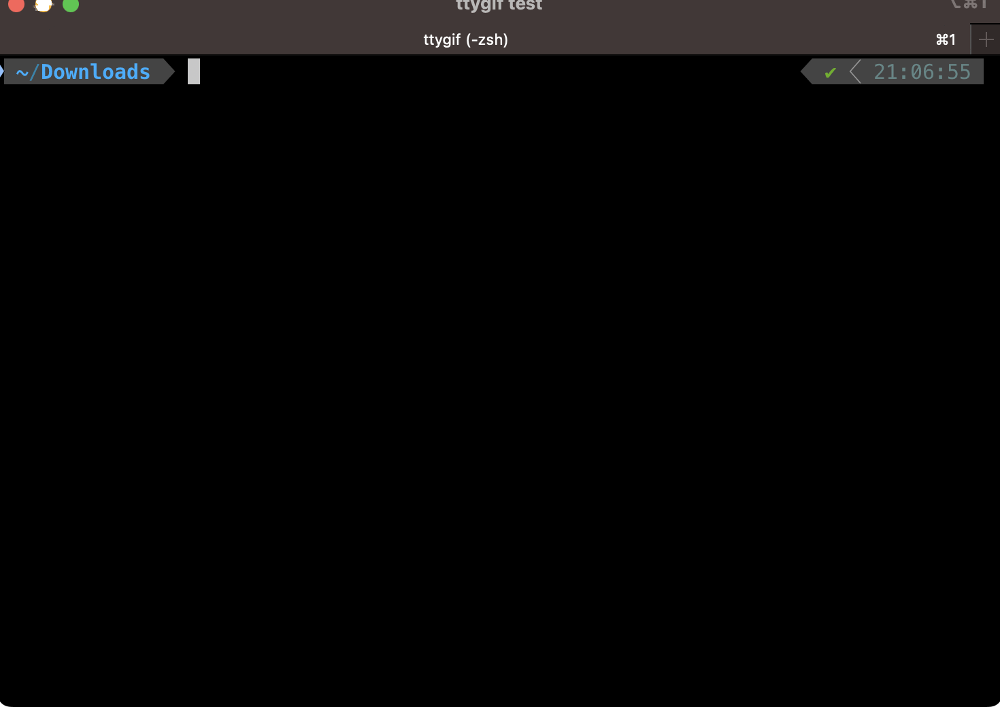
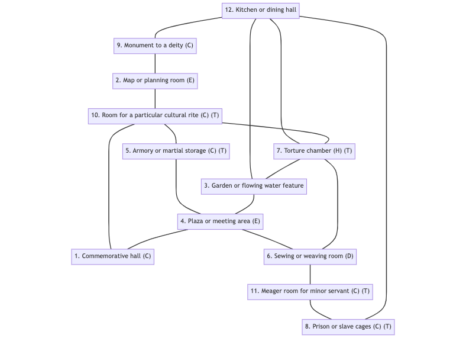

# Map4WWN - Map for Worlds Without Number
This Python 3 script is roughly based on the dungeon creation tool provided in the free edition of [Worlds Without Number](https://www.drivethrurpg.com/product/348809/Worlds-Without-Number-Free-Edition), p. 234 ff

The script will generate a random dungeon in Mermaid syntax, which can then easily be edited or converted to a map with a Mermaid editor such as [Mermaid Live Editor](https://mermaid.live/)

# Example of use
Terminal use:

Which gives something like:

# See also
https://www.greyhawk.games/mapgen/
